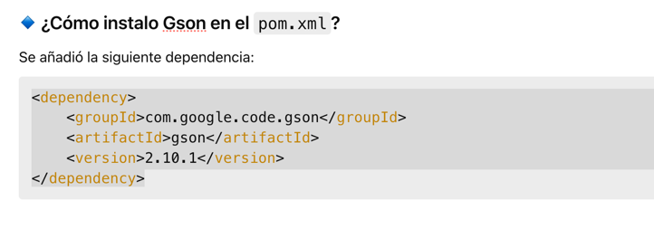
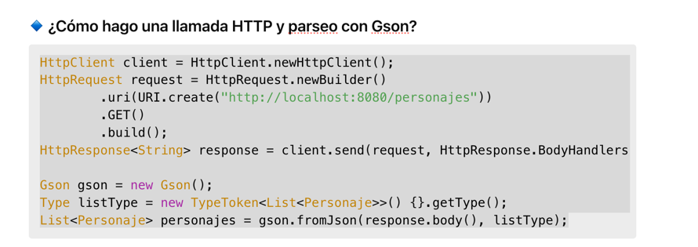
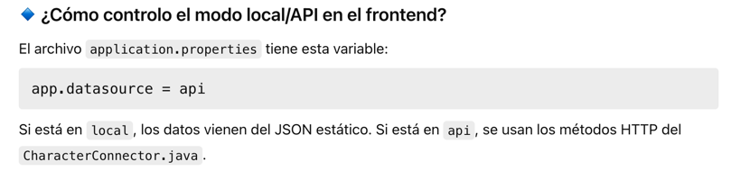
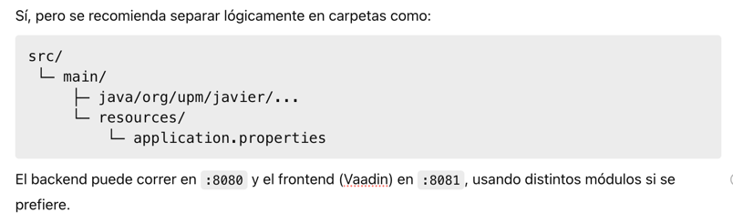
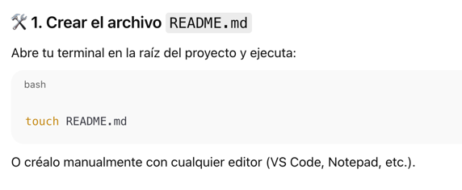

🐉 Proyecto Frontend Dragon Ball API (Vaadin 24)

Este README contiene las preguntas clave realizadas durante el desarrollo del proyecto, junto con sus respuestas y soluciones aplicadas. El foco estuvo en el frontend con Vaadin 24 y la integración con un backend REST desarrollado en Spring Boot. Se utilizó Gson para la serialización y deserialización de datos

Preguntas y soluciones relevantes

Cómo instalo Gson en el pom.xml?

Se añadió la siguiente dependencia:
<dependency>
<groupId>com.google.code.gson</groupId>
<artifactId>gson</artifactId>
<version>2.10.1</version>
</dependency>

¿Cómo hago una llamada HTTP y parseo con Gson?

HttpClient client = HttpClient.newHttpClient();
HttpRequest request = HttpRequest.newBuilder()
.uri(URI.create("http://localhost:8080/personajes"))
.GET()
.build();
HttpResponse<String> response = client.send(request, HttpResponse.BodyHandlers.ofString());

Gson gson = new Gson();
Type listType = new TypeToken<List<Personaje>>() {}.getType();
List<Personaje> personajes = gson.fromJson(response.body(), listType);

¿Cómo controlo el modo local/API en el frontend?
El archivo application.properties tiene esta variable:

app.datasource = api

Si está en local, los datos vienen del JSON estático. Si está en api, se usan los métodos HTTP del CharacterConnector.java.

¿Puedo tener backend y frontend en el mismo proyecto?

Sí, pero se recomienda separar lógicamente en carpetas como:

src/
└─ main/
├─ java/org/upm/javier/...
└─ resources/
└─ application.properties

El backend puede correr en :8080 y el frontend (Vaadin) en :8081, usando distintos módulos si se prefiere.

Tecnologías usadas
Java 17

Spring Boot

Vaadin 24

Gson

Git

TEST USANDO POSTMAN

para crear :
curl --location 'http://localhost:8080/personajes/save' \
--header 'Content-Type: application/json' \
--data '{
"name": "Javier Rodriguez",
"description": "Un guerrero legendario desconocido por el universo, aún por descubrir su verdadero poder.",
"ki": "123456",
"maxKi": "Infinity",
"gender": "Male",
"affiliation": "Z Fighter",
"deletedAt": null,
"id": "a291430b-1e79-468c-8efc-2abd54bacf52",

    "image": "https://dragonball-api.com/characters/cesar_pantoja.webp"
}'

para LISTAR :
curl --location 'localhost:8080/personajes/a291430b-1e79-468c-8efc-2abd54bacf52'